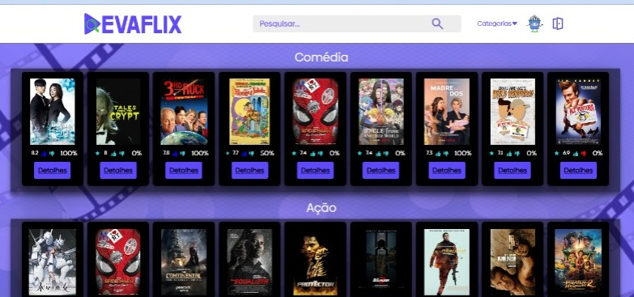

# DEVAFLIX

O projeto DEVAFLIX foi concebido com o propósito de auxiliar os usuários na escolha de filmes e séries, proporcionando uma experiência de busca aprimorada. A plataforma permite usar uma ferramenta de busca com filtros avançados, tais como gênero, ano de lançamento, rating, direção etc.

### O protótipo que utilizado para desenvolver esse projeto esta no  Link do Figma:


```bash
https://www.figma.com/file/8C0ajaF4uQ0SbWVNCMn1Z0/DEVAFLIX?type=design&node-id=0-1&mode=design&t=6QOV1jYFy2dFF7P5-0

```

## Tecnologias Utilizadas

O projeto DEVAFLIX utiliza as seguintes tecnologias:

- React.js 18.2.0
- Bootstrap 5.3.2
- Sass 1.66.1
- Axios 1.5.0
- Vite 4.4.5

## Funcionalidades

- Busca avançada de filmes e séries com base em critérios como gênero, ano de lançamento, rating, direção, etc.
- Exibição de informações detalhadas sobre filmes e séries, incluindo sinopse, elenco, classificação, etc.

## Como Usar

#
### Configuração do ambiente de desenvolvimento
```bash
# clonar o repositório 
git clone https://github.com/LuigiTCastro/DevariaProjectDevaflix-FE.git
 
# Congigure as variaveis
fazer uma copia do arquivo `.env.example` e renomear o novo arquivo de `.env.local`, e configurar as variáveis de ambiente no arquivo `.env.local` 

#  instale as dependencias do projeto 
npm install

# Executar o projeto
 npm run dev
```
## Projeto Finalizado
<div align="center" width="100%">

</div>

#
## Banck-end
https://github.com/LuigiTCastro/DevariaProjectDevaflix-BE.git
 #
### Autor
* **Aline Oliveira**
* **Eliane Henriqueta**
* **Luigi Castro**
* **Renata Fernandes**
* **Sergio Daniel Farina**
